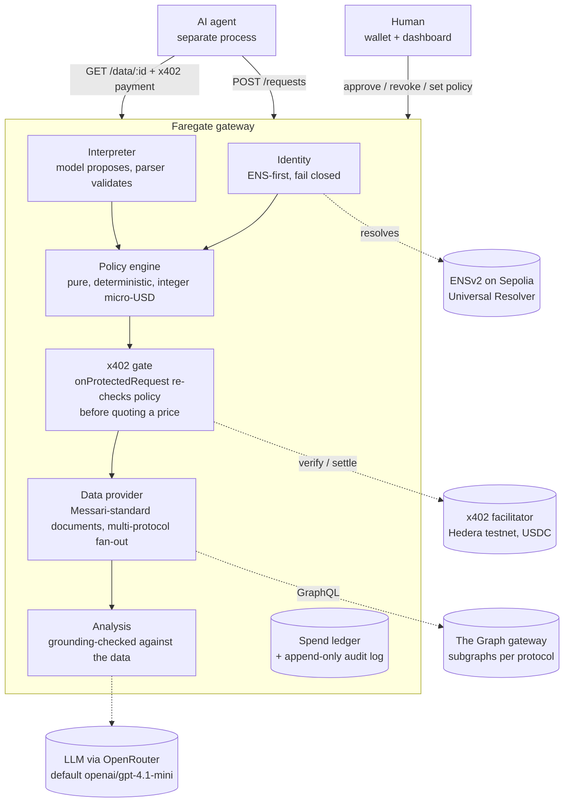

# Faregate

**Agents buy onchain data by the query. Humans decide what they are allowed to buy.**

Faregate is a permission and payment gateway between AI agents and paid
blockchain data. An agent asks for data in plain language. The gateway works
out what it is asking for, checks a capability its human owner set, prices the
query, stops for a human when the policy says so, takes payment over x402 on
Hedera, fetches the data from The Graph, has a model summarise it without
being allowed to invent anything, and records every step. The human can revoke
the agent at any moment, and the agent is turned away at the gate even while
holding an approved quote.

Built for ETHGlobal Online 2026. Category: Artificial Intelligence.

---

## The problem

Autonomous agents increasingly need two things a human used to provide by
hand: access to onchain data, and the ability to pay for it. Today that means
handing an agent an API key and a card on file, and hoping it does not run up
a bill, wander outside its remit, or keep going after you wanted it to stop.

Giving software unrestricted permissions is the failure. What is missing is a
gate: something that gives an agent a *capability* rather than a key, meters
what it uses, asks a human before anything expensive, and can be shut with one
action.

## The product

```
Agent  →  Request  →  Policy  →  Human approval  →  Payment  →  Data  →  Analysis
                         ↑                                                   
                     Revocation (any time, wins over everything)
```

An agent's identity is an ENS name. Its capability is a small policy:

```text
agent:                 research.agents.faregate.eth
scope:                 wallet.balances, wallet.transfers, wallet.activity
max cost per query:    $0.10
daily spend limit:     $1.00
human approval above:  $0.02
```

Everything the gateway decides is decided by a deterministic policy engine from
that capability, the structured query, the spend ledger and the clock. The
language model proposes and narrates; it never decides.

## Why Web3

Three things in Faregate need a chain, and each is load-bearing rather than
decorative.

**Payment.** An agent that pays per query, in sub-cent amounts, with no
account, no subscription and no API key, needs a payment rail that settles at
machine speed for fractions of a cent. x402 over Hedera is that rail: the
gateway answers `402 Payment Required`, the agent signs a USDC transfer, and
the facilitator verifies and settles it. USDC on Hedera has six decimals, which
maps one-to-one onto the micro-USD unit the gateway prices in, so a quote
becomes an atomic amount with no exchange rate to get wrong.

**Identity and revocation.** An agent's passport is an ENSv2 subname on
Sepolia, and its capability lives in the name's text records. Revocation is an
onchain act by the owner, with the owner's wallet: set `faregate.status` to
`revoked`, or unregister the subname. The gateway resolves the passport live on
every request, never caches it, and fails closed if the chain is unreachable.
Nothing in the gateway can un-revoke an agent, because the gateway holds no
key.

**Data.** What the agent is buying is indexed onchain data, served from The
Graph. The query documents are written once against the Messari standardized
lending schema, so a single document fans out unchanged across every protocol
that publishes the standard. That is the leverage of a shared schema: breadth
with no per-protocol code.

## Architecture



Every external dependency is optional. The gateway starts with all four
subsystems in **simulated** mode and says so on `/health`, in its logs, on the
dashboard's top bar, and on every receipt and data card. That mode travels with
the data. Nothing simulated is ever presented as a chain fact, and a live
provider that fails, fails: it never silently falls back to simulated output.

### Repository

```
apps/api        the gateway (Express, TypeScript)
apps/web        the dashboard (Next.js)
apps/agent      the demo agent, a real x402 client in its own process
packages/shared domain model, pricing, policy engine (pure, tested)
scripts/ens     one-command ENSv2 setup, onchain revoke and restore of passports
scripts/hedera  create the gateway account, check and associate USDC
docs/           ARCHITECTURE, DECISIONS, DEMO_SCRIPT, DEPLOY, SECURITY, SPONSOR_MATRIX, SUBMISSION, bounty evidence, ENS guide, OpenAPI
```

## Sponsor integrations

Each of these is real code on a real protocol, not a mention. The full
per-bounty breakdown with file references and honest status is in
[docs/SPONSOR_MATRIX.md](docs/SPONSOR_MATRIX.md).

| Sponsor | What Faregate uses it for | Where |
|---|---|---|
| **Hedera** | x402 payment rail. `@x402/core`, `@x402/express`, `@x402/hedera` v2.25, network `hedera:testnet`, USDC `0.0.429274`. Per-query metering. | `apps/api/src/payment/x402.ts`, `apps/agent/src/index.ts` |
| **The Graph** | The only data source. Messari-standard documents fan out across protocol subgraphs; Bearer-authenticated gateway queries; the model's analysis is grounded against the result. | `apps/api/src/data/provider.ts`, `apps/api/src/ai/provider.ts` |
| **ENS** | Agent passports as ENSv2 subnames on Sepolia, capability in text records, live resolution through `UniversalResolverV2`, revocation onchain. Live on Sepolia: [evidence](docs/bounty-evidence.md#ens-best-use-of-ensv2). | `apps/api/src/identity/`, `scripts/ens/setup.ts`, `scripts/ens/passport.ts` |

## Security, in brief

- Policy is a pure function on the server. The model never makes a decision.
- Money is integer micro-USD; limits cannot drift on a rounding error.
- Prices come from the stored request, never from the caller.
- Policy is re-evaluated at submission, before a price is quoted, and again at
  release. A passport revoked between approval and collection is refused.
- Spend is recorded at collection, not at quote, so unpaid quotes cannot
  exhaust a budget.
- Payment nonces are single-use; a fulfilled request cannot be collected twice;
  submissions are idempotent on a caller key.
- Any structured query, from a caller or from the model, is validated and
  clamped before the policy engine sees it.
- Model summaries are grounding-checked: a hash or address not present in the
  data is replaced with a visible marker and logged.
- Every human action (approve, reject, revoke, set policy, create agent) is
  signed by the acting wallet and verified by the gateway: signer must match,
  ten-minute validity, payload digest, single use.
- Agents are rate-limited per passport; humans per caller.
- No custody, no keys in the gateway, no transaction ever sent by the gateway.

Threat model and limits: [SECURITY.md](SECURITY.md). Why it is built this way:
[docs/DECISIONS.md](docs/DECISIONS.md).

## Setup

```bash
git clone https://github.com/souravmalviya/web3Faregate.git faregate && cd faregate
npm install
cp .env.example .env
npm run build --workspace @faregate/shared
```

Node 22.18 or newer (built on 24), because the TypeScript sources run directly
with type stripping. No other services are required to run the
demo; every subsystem simulates itself until you configure it.

```bash
npm run dev:api     # gateway on http://localhost:8402
npm run dev:web     # dashboard on http://localhost:3000
```

Turn subsystems live one at a time in `.env`:

| Subsystem | Variables | What it needs |
|---|---|---|
| Payment | `FAREGATE_PAY_TO`, `X402_FACILITATOR_URL` | A Hedera testnet account associated with USDC `0.0.429274`. The agent additionally needs `HEDERA_ACCOUNT_ID` and `HEDERA_PRIVATE_KEY`. |
| Data | `GRAPH_API_KEY`, `GRAPH_SUBGRAPHS` | A Subgraph Studio key and `protocol=subgraphId` pairs for subgraphs on the Messari standard schema. |
| AI | `OPENROUTER_API_KEY`, `OPENROUTER_MODEL` | An OpenRouter key. Default model `openai/gpt-4.1-mini`, which supports strict structured outputs. |
| Identity | `ENS_RPC_URL` | Any Sepolia RPC; reads only, so a public one works. |

`GET /health` tells you what is live.

### Every environment variable

| Variable | Default | Purpose |
|---|---|---|
| `PORT` | `8402` | Gateway port |
| `FAREGATE_CORS_ORIGIN` | `http://localhost:3000` | Dashboard origin |
| `FAREGATE_REQUIRE_SIGNED_ACTIONS` | `true` | Human actions must carry a verified wallet signature |
| `FAREGATE_STATE_FILE` | `data/faregate-state.json` | Snapshot file; `off` for memory only |
| `FAREGATE_RATE_LIMIT_REQUESTS_PER_MINUTE` | `60` | Submissions per agent per minute |
| `FAREGATE_RATE_LIMIT_ACTIONS_PER_MINUTE` | `30` | Human actions per caller per minute |
| `FAREGATE_NETWORK` | `hedera:testnet` | CAIP-2 network for pricing and settlement |
| `X402_FACILITATOR_URL` | Blocky402 host for the network | x402 facilitator |
| `FAREGATE_PAY_TO` | unset (payments simulated) | Hedera account that receives fares |
| `FAREGATE_PAY_TO_PRIVATE_KEY` | unset | Read only by `scripts/hedera/*`, never by the gateway |
| `FAREGATE_ASSET` | `0.0.429274` (testnet USDC) | HTS token to charge in |
| `FAREGATE_PAYMENT_TIMEOUT_SECONDS` | `120` | How long a quote stays valid |
| `HEDERA_ACCOUNT_ID`, `HEDERA_PRIVATE_KEY` | unset | The demo agent's paying account (agent process only) |
| `GRAPH_API_KEY` | unset (data simulated) | Subgraph Studio key |
| `GRAPH_SUBGRAPHS` | Aave v3, Compound v3, Spark on Ethereum | `protocol=subgraphId` pairs on the Messari standard schema |
| `OPENROUTER_API_KEY` | unset (AI rule-based) | OpenRouter key |
| `OPENROUTER_MODEL` | `openai/gpt-4.1-mini` | Any OpenRouter model with structured outputs |
| `ENS_RPC_URL` | unset (passports local) | Sepolia RPC for ENSv2 resolution |
| `FAREGATE_PARENT_NAME` | `agents.faregate.eth` | Parent name passports live under |
| `ENS_UNIVERSAL_RESOLVER` | ENSv2 beta address | Override only if ENS redeploys |
| `ENS_OWNER_PRIVATE_KEY` | unset | Throwaway Sepolia key, read only by `scripts/ens` (`ens:setup`, `ens:revoke`, `ens:restore`) |
| `ENS_SETUP_RPC_URL` | public Sepolia RPC | RPC for the ENS scripts, kept apart from `ENS_RPC_URL` |
| `FAREGATE_TRUST_PROXY` | `false` | `true` behind a hosting proxy, so per-caller limits see the client address |
| `NEXT_PUBLIC_FAREGATE_GATEWAY_URL` | `http://localhost:8402` | Where the dashboard finds the gateway |

### Networks

| Subsystem | Network | Asset or contract |
|---|---|---|
| Payment | Hedera testnet (`hedera:testnet`) | USDC `0.0.429274`, settled by Blocky402 |
| Identity | Ethereum Sepolia | ENSv2 beta, `UniversalResolverV2` |
| Data | The Graph gateway | Messari-standard subgraphs for Aave v3, Compound v3, Spark |

Never point a demo at mainnet.

## Demo

The demo is scripted in [docs/DEMO_SCRIPT.md](docs/DEMO_SCRIPT.md) and the
runbook is [DEMO.md](DEMO.md). The short version:

```bash
# terminal 1
npm run dev:api
# terminal 2
npm run dev:web
# terminal 3: the agent asks, the dashboard stops it for approval, you approve
npm run agent
# revoke the agent onchain, then hand it an approved quote it has not collected
npm run ens:revoke -- research.agents.faregate.eth
npm run agent -- --agent research.agents.faregate.eth --request <id>
#   ✗ Refused at the gate: This agent passport has been revoked by its owner.
#     The agent offered to pay and was still turned away.
```

## Tests

```bash
npm test          # 124 tests: policy engine, pricing, signed actions, store persistence, rate limiting, AI grounding, data fan-out, identity fail-closed, HTTP surface
npm run e2e:live -- --yes   # live, testnet: real Hedera payments, Graph data, AI, ENS revoke and restore
npm run typecheck
npm run lint      # ESLint on the dashboard
npm run build
npm run check     # all of the above in one go
```

The HTTP suite boots the real app on an ephemeral port and covers the full
lifecycle, idempotent replay, validation of untrusted structured queries, the
daily limit across requests, spend recorded at collection rather than quote,
revocation before and after approval, and the audit trail order.

## Limitations

Honest ones.

- State is a local snapshot file: one gateway, one machine. ENS passports are
  unaffected because the chain is the record.
- Signatures prove who acted, not that they were entitled to. Any wallet can
  approve any request; tying an agent to the wallet that created it is a
  policy field away.
- The Graph documents target the Messari lending schema; a subgraph that does
  not publish it returns `schema_mismatch` rather than data.
- ENSv2 is beta on Sepolia. The passport script dry-runs by default and cites
  the page each interface came from.
- Live x402 settlement has been verified against the packages' type
  definitions and the Hedera reference implementation, and end to end in
  simulated mode. Settling against a funded testnet account is the operator's
  step.

## Future work

- Owner binding: only the wallet that created an agent may approve for it.
- HCS audit anchoring: write each settled payment to a Hedera Consensus Service
  topic so the audit trail is verifiable off the gateway.
- Persisted state and multi-tenant passports.
- Liveness-gated spend tiers, so a verified human unlocks a larger budget for
  their agents.
- Streaming settlement for long-running data subscriptions.

## Licence

MIT. See [LICENSE](LICENSE).
